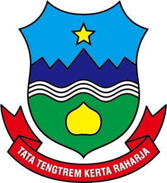

<div align="center">



# WebGIS Desa Mekarjaya

Portal informasi geospasial Desa Mekarjaya, Kecamatan Cikajang, Kabupaten Garut, Jawa Barat.
Peta interaktif fasilitas desa, profil desa berbasis basis data, dan panel admin ber-JWT.

</div>

---

## Tech Stack

**Frontend**

<p>


</p>

**Backend**

<p>


</p>

**Peralatan**

<p>


</p>

---

## Apa yang ada di dalamnya

**Peta interaktif** (`/map`) memuat penanda lokasi berkelompok (marker clustering), filter kategori,
pencarian, dan dua lapisan batas wilayah dari GeoJSON: batas desa dan pembagian RW. Di layar kecil,
daftar lokasi muncul sebagai bottom sheet yang bisa ditarik, bukan disembunyikan.

**Profil desa** (`/desa`) menarik seluruh isinya dari basis data: gambaran umum, visi & misi,
data wilayah (luas, ketinggian, jumlah RW/RT, batas administratif), rekap penduduk per dusun,
APBDes tiga kolom beserta realisasinya, dan riwayat periode kepala desa dengan programnya.

**Panel admin** (`/admin`) dijaga JWT, mengelola seluruh isi di atas plus unggah gambar.
Tidak ada tautan menuju panel ini dari halaman publik.

**Koordinat disimpan sebagai `[lng, lat]`** di kolom JSON, mengikuti urutan GeoJSON. Leaflet
meminta `[lat, lng]`, jadi frontend membaliknya saat dipakai. Urutan penyimpanan ini jangan diubah.

---

## Menjalankan secara lokal

Prasyarat: Node.js 20+ dan MySQL 8.

**1. Basis data**

```bash
mysql -u root -p < backend/database/schema.sql
```

**2. Backend**

```bash
cd backend
npm install
cp .env.example .env    # lalu isi kredensial basis data dan JWT_SECRET
npm run seed:admin
npm run dev
```

Berjalan di `http://localhost:5000`.

**3. Frontend**

```bash
cd frontend
npm install
npm run dev
```

Berjalan di `http://localhost:5173`.

### Variabel lingkungan

`backend/.env` (contoh lengkap ada di `backend/.env.example`):

| Variabel | Wajib | Keterangan |
|---|---|---|
| `DB_HOST` `DB_USER` `DB_PASSWORD` `DB_NAME` | ya | Kredensial MySQL |
| `JWT_SECRET` | ya | Kunci penandatangan token admin. Bangkitkan dengan `openssl rand -hex 32` |
| `PORT` | tidak | Bawaan `5000` |
| `ADMIN_USERNAME` `ADMIN_PASSWORD` | tidak | Dipakai `npm run seed:admin`, bawaan `admin` / `admin123` |

Frontend membaca `VITE_API_URL`, bawaannya `http://localhost:5000`.

> **Ganti kata sandi admin sebelum dipakai sungguhan.** Jalankan ulang `npm run seed:admin`
> setelah mengubah `ADMIN_USERNAME` / `ADMIN_PASSWORD`.

---

## Perintah

| Direktori | Perintah | Kegunaan |
|---|---|---|
| `backend` | `npm run dev` | Server dengan nodemon, port 5000 |
| `backend` | `npm start` | Server tanpa watcher |
| `backend` | `npm run seed:admin` | Membuat atau memperbarui akun admin |
| `backend` | `npm run clear:data` | Mengosongkan tabel konten. Destruktif |
| `frontend` | `npm run dev` | Vite, port 5173 |
| `frontend` | `npm run build` | `tsc -b` lalu `vite build` |
| `frontend` | `npm run lint` | oxlint |
| `frontend` | `npm run preview` | Menyajikan hasil build di port 4173 |

---

## Arsitektur

Alur permintaan untuk data publik:

```
hooks/use*.ts (React Query)
  -> services/api.ts (axios)
    -> routes/api.js
      -> controllers/*.js
        -> db.js (satu pool mysql2)
          -> MySQL
```

`backend/db.js` mengekspor satu-satunya pool koneksi. Setiap controller mengimpornya.
Jangan membuat pool kedua.

**Dua jenis controller.** `backend/lib/crudFactory.js` membangkitkan `list` / `create` / `update` /
`remove` untuk tabel sederhana; `apbdController` dan `hamletController` adalah pembungkus tipis di
atasnya. Selalu berikan `allowedFields`, karena tanpa itu factory memercayai kunci apa pun yang
datang dari badan permintaan. Tabel yang butuh join atau penyusunan bersarang
(`locationController`, `periodController`, `villageController`) ditulis tangan.

**Autentikasi.** `POST /api/auth/login` memeriksa hash bcrypt di tabel `admins` dan mengembalikan
JWT. `middleware/auth.js` memverifikasi header `Authorization: Bearer <token>`. Di sisi frontend,
`services/adminApi.ts` adalah instance axios terpisah yang menyisipkan token dan mengalihkan ke
`/admin/login` saat menerima 401 atau 403. Panggilan publik lewat `services/api.ts` tanpa token.

**Unggah berkas.** `POST /api/upload` didaftarkan langsung di `server.js`, bukan di tabel rute.
Multer menyimpan ke `backend/uploads/`, disajikan di `/uploads/...`, batas 5 MB, hanya mimetype gambar.

**CORS** berupa daftar putih tetap di `server.js` (`localhost:5173`, `localhost:4173`).
Origin frontend baru harus ditambahkan di sana atau permintaannya gagal tanpa pesan.

### Struktur direktori

```
backend/
  controllers/    Penangan rute per entitas
  lib/            crudFactory
  middleware/     Verifikasi JWT
  routes/api.js   Seluruh tabel rute
  database/       schema.sql
  scripts/        seedAdmin, clearData
  uploads/        Gambar unggahan admin, diabaikan git
frontend/src/
  components/     map/, village/, admin/, layout/, ui/
  hooks/          Pembungkus React Query + useGeoJson, useSmoothScroll
  lib/            i18n, utils, leafletIcons, apbd, demographics
  pages/          Halaman publik dan admin/
  services/       api.ts (publik), adminApi.ts (ber-token)
frontend/public/geojson/
  desa.geojson    Batas desa
  rw.geojson      Batas RW
```

---

## API

Seluruh `GET` di bawah bersifat publik. Setiap `/admin/*` memerlukan header
`Authorization: Bearer <token>`.

| Metode | Endpoint | Keterangan |
|---|---|---|
| `POST` | `/api/auth/login` | Menukar kredensial dengan JWT |
| `GET` | `/api/locations` | Seluruh lokasi |
| `GET` | `/api/locations/:slug` | Satu lokasi beserta kategorinya |
| `GET` | `/api/categories` | Seluruh kategori |
| `GET` | `/api/categories/:slug/locations` | Lokasi dalam satu kategori |
| `GET` | `/api/profile` | Profil desa, baris tunggal |
| `GET` | `/api/hamlets` | Rekap penduduk per dusun, periode terbaru |
| `GET` | `/api/apbd` | Pos APBDes, dukung `?year=` |
| `GET` | `/api/periods` | Periode kepala desa beserta programnya |
| `POST` `PUT` `DELETE` | `/api/admin/locations`, `/categories`, `/hamlets`, `/apbd`, `/periods`, `/programs` | CRUD terproteksi |
| `PUT` | `/api/admin/profile` | Memperbarui profil desa |
| `POST` | `/api/upload` | Unggah gambar, terproteksi |

---

## Basis data

`backend/database/schema.sql` adalah satu-satunya artefak skema. Tidak ada berkas migrasi.
Skrip itu memakai `CREATE TABLE IF NOT EXISTS`, sehingga menjalankannya ulang pada basis data
yang sudah ada **tidak** akan menambahkan kolom baru. Saat mengubah skema, sunting `schema.sql`
**dan** terapkan `ALTER TABLE` yang setara ke basis data yang sedang berjalan secara manual.

| Tabel | Isi |
|---|---|
| `categories` | Kategori lokasi beserta slug dan ikon |
| `locations` | Fasilitas dan potensi desa, `coordinates` JSON `[lng, lat]` |
| `admins` | Akun admin, kata sandi ter-hash bcrypt |
| `village_profiles` | Baris tunggal `id=1`: profil, visi, misi, data wilayah |
| `village_hamlets` | Rekap penduduk bulanan per dusun dan RW |
| `apbd_items` | Pos APBDes: `amount` pagu anggaran, `realisasi` dana terserap |
| `village_periods` | Periode kepala desa |
| `period_programs` | Program dalam satu periode |

Dua keputusan yang sengaja diambil:

- **`village_hamlets` tidak menyimpan total penduduk.** Selalu dihitung `male + female`, supaya
  tidak mungkin berbeda dari rinciannya. Di laporan kertas, kolom jumlahnya pernah salah ketik.
- **`apbd_items.realisasi` boleh `NULL`.** Pos yang belum terealisasi berbeda maknanya dari pos
  yang terealisasi Rp 0, dan perbedaan itu harus bisa dipertahankan.

---

## Konvensi yang mudah keliru

- **Urutan koordinat.** Kolom `coordinates` menyimpan `[lng, lat]`. Leaflet meminta `[lat, lng]`.
  Pembalikannya terjadi di frontend, bukan di basis data.
- **Sufiks `_id` berarti Indonesia, bukan identifier.** `name_id`, `description_id`, `title_id`,
  `vision_id` adalah kolom teks berbahasa Indonesia. Dukungan multi-bahasa sudah dihapus.
- **Teks antarmuka lewat i18next.** Satu locale `id` di `src/lib/i18n.ts`. Sebagian kunci dibentuk
  secara dinamis, misalnya ``t(`village.apbd_type_${type}`)``, sehingga pencarian teks biasa bisa
  meleset menganggapnya tidak terpakai.
- **Tailwind v4 tanpa berkas konfigurasi.** Token tema berada di blok `@theme` dalam
  `src/index.css`. Tidak ada `tailwind.config.js` maupun `postcss.config.js`.
- **Tanpa mode gelap.** Aplikasi ini terang saja, dan `index.css` tidak memuat aturan `.dark`.
- **react-router v8.** Impor dari `'react-router'`. `react-router-dom` bukan dependensi.
- **Lenis memegang posisi scroll.** `el.scrollIntoView()` tidak menghasilkan gerakan apa pun selama
  Lenis aktif. Pakai `scrollKeAtas()` atau `scrollKeElemen()` dari `hooks/useSmoothScroll.ts`.

---

## Batasan yang diketahui

- **Tidak ada rangkaian pengujian.** `npm test` di `backend` adalah stub yang keluar dengan kode 1.
  Verifikasi untuk perubahan frontend adalah `npm run build`: `tsconfig.app.json` menyalakan
  `noUnusedLocals` dan `noUnusedParameters`, sehingga impor dan variabel mati tertangkap di sana.
  Perubahan backend diuji dengan memanggil endpoint yang bersangkutan.
- **`vite build` memperingatkan chunk di atas 500 kB** (Leaflet, Recharts, GSAP, framer-motion).
  Sudah diketahui, belum dipecah.
- **URL gambar unggahan disimpan absolut**, dibentuk dari host permintaan di `server.js`. Setelah
  di-deploy, gambar yang diunggah saat pengembangan akan tetap menunjuk ke `localhost`.

---

## Lisensi

Repositori ini memuat dua hal dengan ketentuan berbeda.

**Kode sumber** — [MIT License](LICENSE), © 2026 KKN ITG 02 Mekarjaya .
Bebas dipakai, diubah, dan disebarluaskan, termasuk oleh desa lain yang
ingin membangun portal serupa, selama pemberitahuan hak cipta dipertahankan.

**Data desa** — © Pemerintah Desa Mekarjaya, Kecamatan Cikajang, Kabupaten Garut.
Mencakup isi basis data (profil desa, rekap penduduk per dusun, pos APBDes,
periode kepala desa), berkas GeoJSON di `frontend/public/geojson/`, foto lokasi
di `backend/uploads/`, dan lambang desa. Seluruhnya dikumpulkan melalui survei
lapangan bersama perangkat desa dan **tidak** tercakup lisensi MIT di atas.
Penggunaan ulang memerlukan izin Pemerintah Desa Mekarjaya.

## Atribusi

- Ubin peta dasar: © [OpenStreetMap](https://www.openstreetmap.org/copyright)
  contributors, dilisensikan ODbL
- Data lokasi dan batas wilayah: survei lapangan bersama Pemerintah Desa Mekarjaya